# Physical-Unity Workflow Diagrams

> Powered by [cc-initializer](https://github.com/tygwan/cc-initializer) | 38 Agents, 22 Skills, 6 Hooks, 6 Commands

---

## 1. System Overview (Top-Level Architecture)

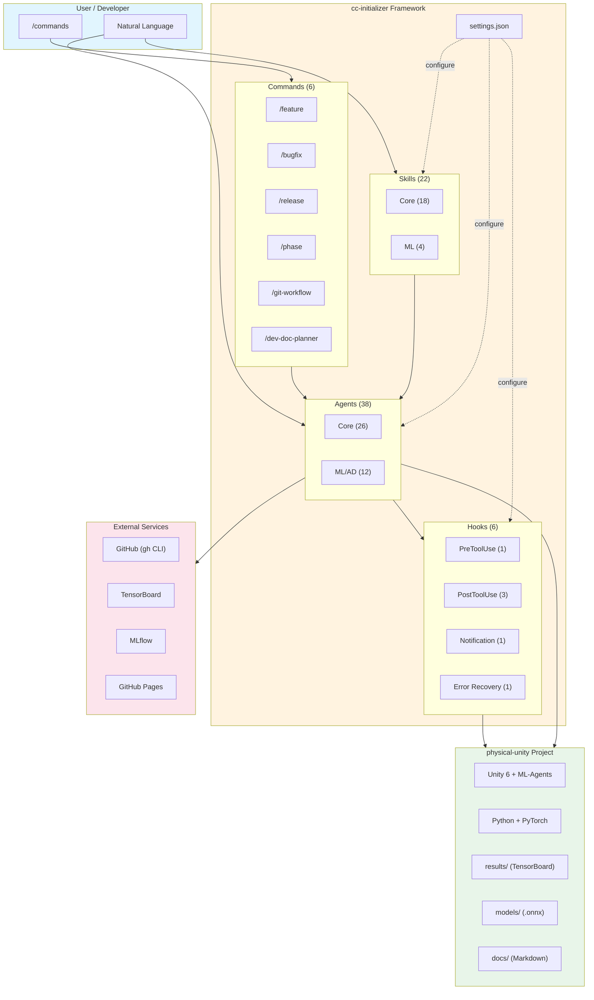

---

## 2. ML Training Workflow (Core Loop)

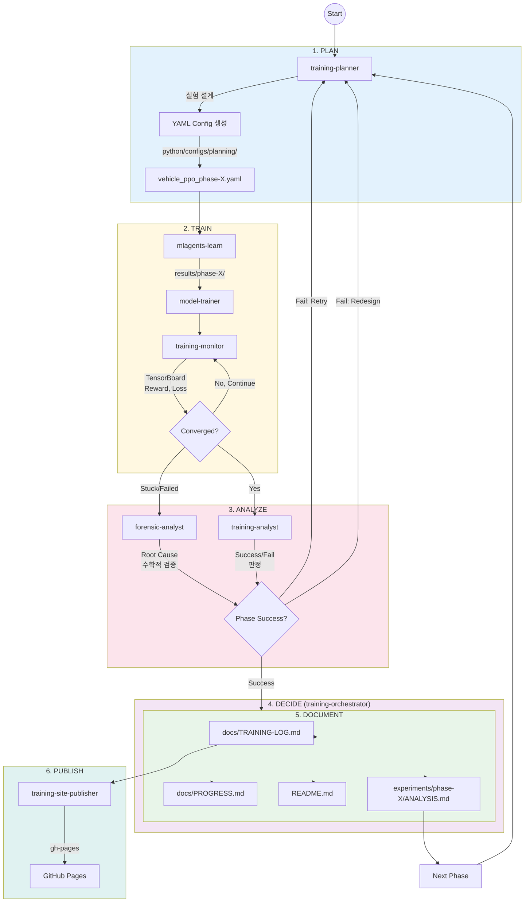

---

## 3. Training Orchestrator State Machine

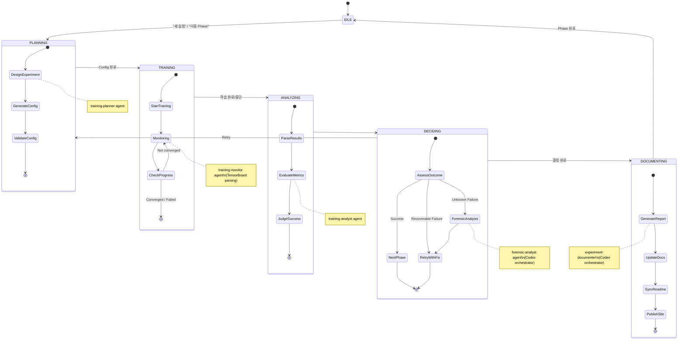

---

## 4. Feature Development Workflow (/feature)

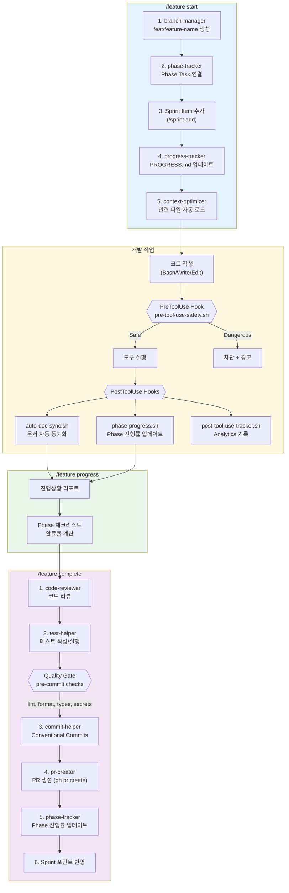

---

## 5. Bug Fix Workflow (/bugfix)

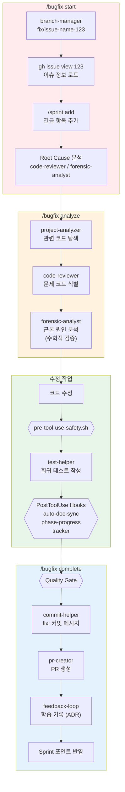

---

## 6. Release Workflow (/release)

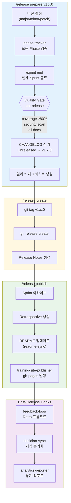

---

## 7. Hook Execution Flow

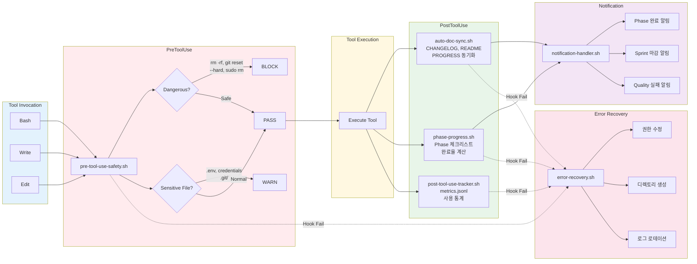

---

## 8. Phase-Based Development Lifecycle

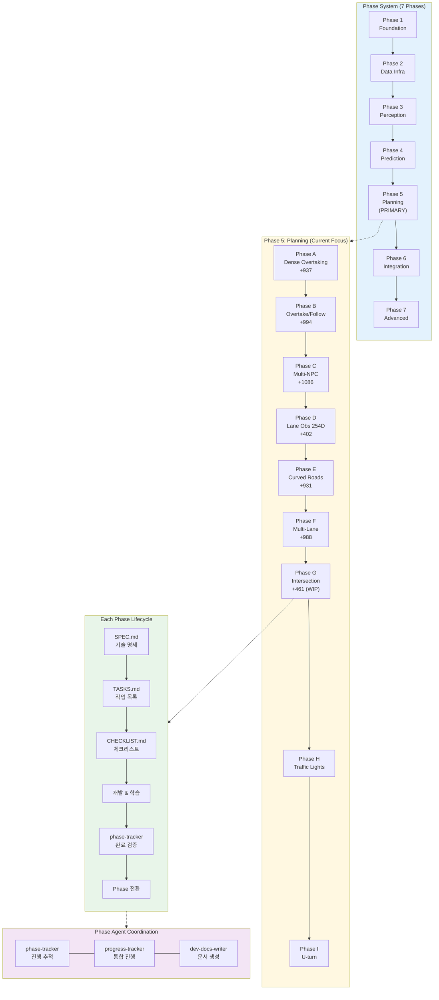

---

## 9. Quality Gate Pipeline

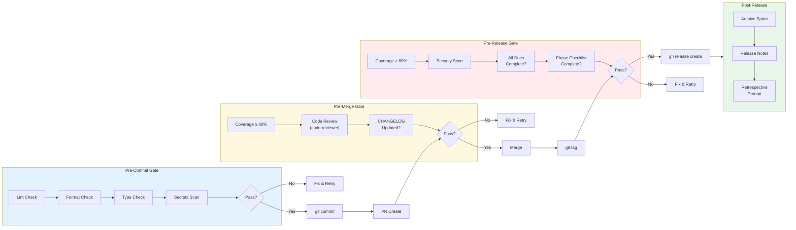

---

## 10. Agent Interaction Map

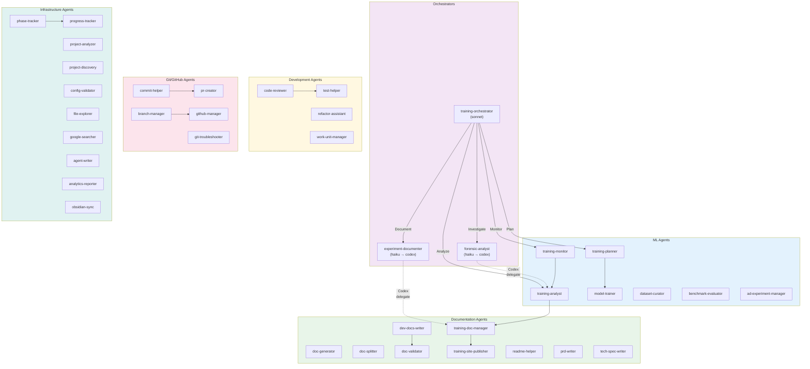

---

## 11. Codex Orchestrator Pattern

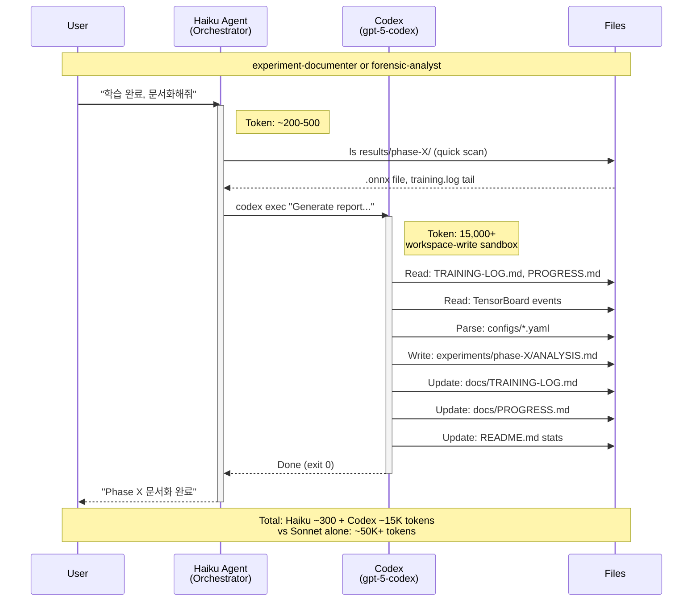

---

## 12. Git Workflow (/git-workflow)

```mermaid
gitgraph
    commit id: "v1.0.0" tag: "release"
    branch feature/phase-G
    checkout feature/phase-G
    commit id: "feat: intersection env"
    commit id: "feat: T-junction reward"
    commit id: "feat: cross intersection"
    checkout main
    merge feature/phase-G id: "PR #42" tag: "squash"
    branch fix/collision-bug
    checkout fix/collision-bug
    commit id: "fix: collision detection"
    commit id: "test: add regression"
    checkout main
    merge fix/collision-bug id: "PR #43" tag: "squash"
    commit id: "v1.1.0" tag: "release"
```

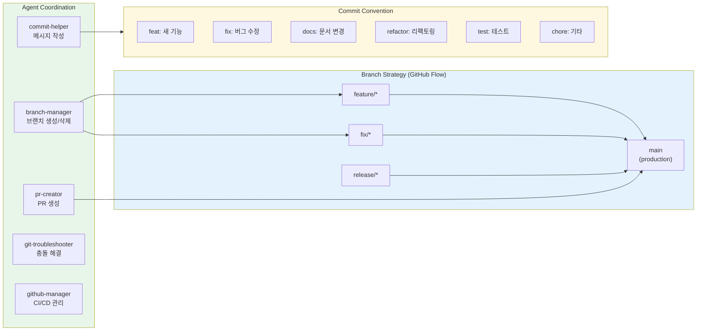

---

## 13. Documentation Automation Flow

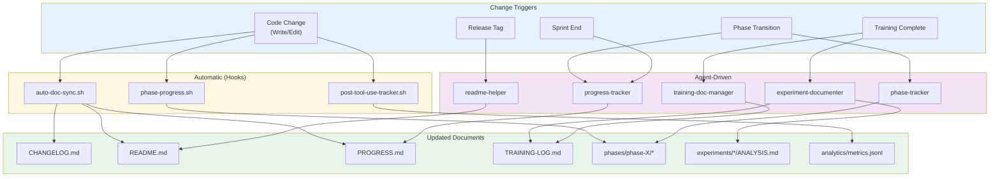

---

## 14. Analytics & Monitoring Pipeline

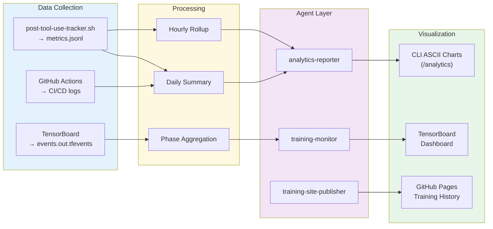

---

## 15. End-to-End Scenario: New Phase Training

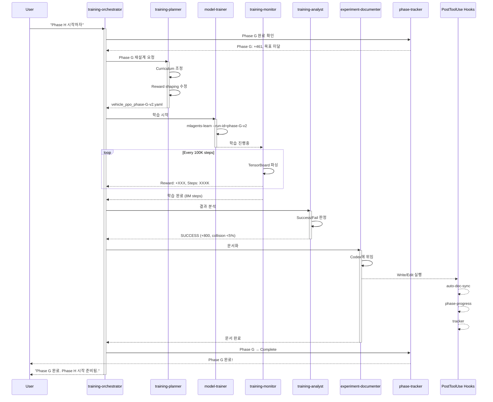

---

## Summary

| Diagram | Content | Key Components |
|---------|---------|----------------|
| #1 System Overview | 전체 아키텍처 | 38 Agents, 22 Skills, 6 Hooks |
| #2 ML Training | 학습 메인 루프 | Plan → Train → Analyze → Document |
| #3 State Machine | Orchestrator 상태 | PLAN → TRAIN → ANALYZE → DECIDE → DOCUMENT |
| #4 Feature Dev | /feature 워크플로우 | start → dev → progress → complete |
| #5 Bug Fix | /bugfix 워크플로우 | start → analyze → fix → complete |
| #6 Release | /release 워크플로우 | prepare → create → publish |
| #7 Hook Flow | Hook 실행 흐름 | Pre → Execute → Post → Notify → Recovery |
| #8 Phase Lifecycle | Phase 기반 개발 | 7 Phases, Phase 5 detail (A~I) |
| #9 Quality Gate | 품질 파이프라인 | pre-commit → pre-merge → pre-release |
| #10 Agent Map | Agent 상호작용 | 6 groups, orchestrator pattern |
| #11 Codex Pattern | Codex 위임 패턴 | Haiku → Codex delegation |
| #12 Git Workflow | Git 전략 | GitHub Flow + Conventional Commits |
| #13 Doc Automation | 문서 자동화 | Hooks + Agents → Documents |
| #14 Analytics | 분석 파이프라인 | Collection → Processing → Visualization |
| #15 E2E Scenario | 전체 시나리오 | New Phase Training (sequence) |

---

**Generated**: 2026-01-29 | **Framework**: [cc-initializer](https://github.com/tygwan/cc-initializer) | **Project**: physical-unity
