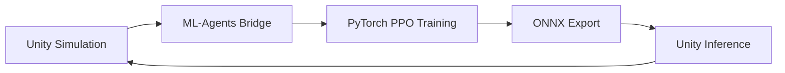

# Autonomous Driving ML Platform

End-to-end motion planning using **PPO reinforcement learning** with curriculum-based training.

## Overview

This platform trains autonomous driving agents through progressive curriculum learning across 7 phases, from basic lane keeping to intersection navigation.

| Component | Technology |
|-----------|------------|
| Simulation | Unity 6 + ML-Agents 3.0 |
| ML Engine | PyTorch 2.0+ |
| RL Algorithm | PPO (Proximal Policy Optimization) |
| Middleware | ROS2 Humble |
| Hardware | RTX 4090 (24GB VRAM) |

## Training Results

| Phase | Name | Reward | Status |
|-------|------|--------|--------|
| A | Dense Overtaking | +937 | SUCCESS |
| B | Decision Learning | +994 | SUCCESS |
| C | Multi-NPC Generalization | +1,086 | SUCCESS |
| D | Lane Observation (254D) | — | IN PROGRESS |
| E | Curved Roads | +931 | SUCCESS |
| F | Multi-Lane | +988 | SUCCESS |
| G | Intersection | +492 | IN PROGRESS |

## Architecture

```
Observation (254D) → PPO Policy (512×3) → Action (2D)
     ↓                    ↓                    ↓
ego/route/NPC/lane    3-layer MLP         accel + steer
```

### Pipeline



## Quick Links

- [PRD](prd.md) - Product Requirements Document
- [Tech Spec](tech-spec.md) - Technical Specification
- [Progress](progress.md) - Development Progress
- [SOTIF Strategy](safety/sotif-edge-case-strategy.md) - Safety Standards Integration
